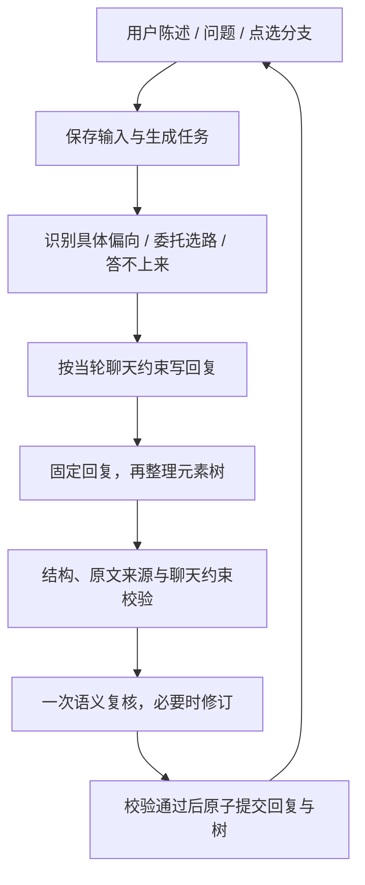

# 拾刻 · 元素树版 MVP

## 项目介绍

**拾刻**是一个陪用户把「还没想清楚的念头」继续聊下去的灵感对话 Agent。它不预设答案，也不急着给建议，而是在自然聊天中接住用户真正关注的细节，让用户从被动碰运气，逐渐变成主动思考的人。

与普通聊天机器人不同，拾刻会把对话中反复出现的经历、感受和理解组织成一棵持续生长的**元素树**：同一种理解会逐渐深入，新的理解会形成分支。当用户明确表达偏向时，它顺着用户的方向继续；当用户完全迷茫时，它会临时选择一条有潜力的线索陪用户走一段，但不会把这条路当成最终答案。

对话越久，拾刻也会逐渐了解每个人稳定的身份、经历、兴趣、正在做的事情和沟通偏好。用户可以查看、纠正或删除这些个人记忆。它的目标不是替用户完成思考，而是创造一种类似人与人聊天的空间：即使这一刻没有得到灵感，聊着聊着，也可能看见原本没有注意到的东西。

核心能力：

- 自然聊天中的隐性引导，不把对话变成连续审问或说教。
- 元素树记录理解的深化、分叉、否定与来源原话。
- 根据用户偏向决定跟随用户，或在迷茫时暂时自主选路。
- 跨会话个人记忆，逐渐适应每个人的背景与思考方式。
- 对话足迹、阶段总结和灵感笔记，帮助用户回看思考如何发生。

当前仓库同时提供真实模型本地版和 GitHub Pages 静态交互演示版。演示版用于展示界面与产品流程，不连接模型，也不会暴露 API Key。

GitHub Pages 演示部署见 [`GITHUB-PAGES.md`](GITHUB-PAGES.md)。需要真实模型的完整公网部署仍可使用仓库根目录的 `render.yaml`，操作见 [`DEPLOY-RENDER.md`](DEPLOY-RENDER.md)。完整公网模式使用签名浏览器 Cookie 隔离每位访客的会话、个人记忆和灵感笔记；模型密钥只从服务器环境变量读取，访客不能打开或修改模型设置，并有基础的每 IP 小时限流。本地模式继续使用现有单用户数据，不受影响。

2026-09-23 新版 `local-guidance-2`：局部有引导，整体不预设结论。每轮接住一个细节、相关时回接旧理解，根据用户的补充、纠正或换话题调整。允许不提问、不产出结论；只有明确索要做法才给方案。详细边界与验证方式见 `CONVERSATION-HARNESS.md`。已有服务请运行 `apply-update.cmd`，地址仍为 8782。

## 启动

需要 Python 3.10+，后端无第三方依赖。Windows 双击 `start.cmd`，打开 **http://127.0.0.1:8782/**。诊断启动使用 `start-debug.cmd`。通用命令：

```sh
python app.py --port 8782
```

页面左下角「模型设置」填写 API 基础地址、模型名称与密钥，测试成功后保存。DeepSeek 接入使用 `https://api.deepseek.com` 与 `deepseek-chat`，使用其 [JSON 输出接口](https://api-docs.deepseek.com/guides/json_mode/)。其他支持 Chat Completions 和 JSON 模式的兼容服务也可配置，但本版仅实测 DeepSeek。

本机交付目录已配置用户提供的 DeepSeek 密钥；**压缩包不含任何密钥、数据库或用户对话**。解压到其他机器时需要重新配置。密钥保存在本机 `data/settings.json`，页面不会返回已保存的密钥值。上下文会发送至配置的模型服务。

## 使用

2026-09-24 `tree-navigation-1`：树每次最多展示三层，默认聚焦当前分支；更多同层节点按组翻页，更深的节点通过「进入分支」查看。可以回到上一层、全部主题或正在聊的分支。记录初始显示最近八条，足迹显示最近四十条，均可继续加载更早内容，不删除原始记录。

2026-09-24 `task-frame-1`：明确任务与元素树分开保存。Agent分别记住要交付什么、项目取材于什么、必须满足和明确排除什么、当前还缺什么，避免把“更换项目题材”误解为“取消项目”。「对/嗯/确实」不会取消未完成求助；仍在找办法时，Agent不再突然劝停，而会沿刚确认的内容贡献下一小步。

2026-09-24 `personal-memory-1`：新增跨会话的个人记忆。同一位本机用户在不同聊天中明确说过的身份、职业、兴趣、长期事项和沟通偏好可以被再次召回；思维方式只能作为逐次验证的假设。页面左下角「关于你」展示来源与可信度，并允许标记不准确、恢复或永久忘记。

2026-09-24 `closing-ack-1`：区分「确认后继续」与「致谢后收住」。单独说「确实、有道理」时，可以沿未完成求助贡献新的内容；说「好的，谢谢」时只简短回应，不追问、不补建议，也不重复上一条。话题、任务和沟通偏好仍会保留，之后可以自然接着聊。程序同时拦截确认或致谢后与上一条高度相似的回复。

1. 输入经历或问题。Agent 分别判断用户偏向和当前方向的信息是否够用，再回应。
2. 右侧元素树随成功完成的轮次更新；实线节点来自用户，虚线节点是待确认想法。
3. 点击节点查看摘要、编号的提及记录、原话、此前的问题和理解版本。点击「沿着这里聊」明确指定分支。
4. 同一种理解会积累证据；另一种理解会分叉。旧理解保留，否定的解释会标记并退出可选方向。
5. 「对话足迹」显示实际探索路径，并可跳转到对应回复。
6. 「总结对话」在消息流里生成一张样式独立的阶段总结卡片，不再重复显示常规助手消息和常驻编辑框。点击卡片（桌面端也可右键）才展开编辑与保存；总结和保存都不结束对话。
7. 生成时可「停止回复」：保留输入，继续聊天，不再插入迟到的回复。页面不再提供常驻「先放一放」。
8. 「这次到这里」归档会话，不强制生成总结。左侧「已归档」中打开并点「接着聊」即可恢复；手机通过「历史聊天」访问。失败时保留输入，可重试。
9. 「关于你」展示跨聊天保留的个人记忆。事实均带用户原话来源；待确认理解会标出可信度。用户可以纠正或删除。

首页的树示例是**固定的真实模型对话回放**，界面明确标注；回放不能交互发送消息。它只用于展示界面，不用于冒充实时生成。

## 实现

- `agent/model.py`：真实模型调用、独立意图识别、先聊天后记忆的生成流程、语义复核与修订。
- `agent/harness.py`：当轮建议许可、停问约束、无预定终点的聊天契约。
- `agent/frame.py`：有原话来源的任务框架，区分交付目标、题材来源、要求、排除项和未解决需求。
- `agent/profile.py`：跨会话个人记忆的来源校验、可信度、生长、召回、纠正与遗忘。
- `agent/attention.py`：有界的记忆召回、当轮接话动作及原话引用校验；不维护最终目标或后续路线。
- `agent/memory.py`：从完整存档选择当前节点、近邻祖先和相关旧理解，控制模型上下文大小。
- `agent/tree.py`：来源原文检查、树结构校验、节点合并与分叉、历史保留、方向约束。
- `agent/service.py`：SQLite 事务、版本冲突、请求去重、后台生成、暂停与过期结果隔离。
- `app.py`：仅绑定本机的 HTTP 服务与本地设置接口。
- `web/`：无框架界面，桌面并排展示对话与树，手机切换查看。

实际对话使用真实模型，不存在规则模板生成器。精确的「暂停」「结束」等生命周期命令由程序处理，避免这些操作依赖模型。

## 状态与每轮执行



会话状态：ACTIVE、REFLECT、PAUSED、DONE。ACTIVE 内部模式为 DISCOVER（了解信息）与 EXPLORE（展开思路），每轮由模型根据当前分支判断，可以来回转换。没有固定轮次或字数门槛。

请求状态独立为 IDLE、GENERATING、ERROR。停止回复使旧生成令牌失效，清除待生成任务并保持 ACTIVE；归档转为 DONE，恢复后不自动生成。正在进行的外部 HTTP 请求可能仍会完成，但迟到结果不会提交。旧版 PAUSED 会话仍可恢复，精确输入「暂停」仍兼容原行为。每个事件有唯一请求 ID 和会话版本。

用户委托选路时要求 AGENT；明确偏向时要求 USER；点击分支还会校验下一焦点必须在该分支内。意图识别本身仍是模型判断，不能保证总是正确。

元素节点保存：标签、当前摘要、父节点、生长关系、fact/hypothesis、active/rejected、原始用户消息引用、逐次压缩记录、摘要版本。add + alternative 的 parent 表示要分叉的理解，程序将新增节点放在其共同父节点下；若该理解是根，则在根下生长。update 不允许移动既有节点。

原始消息和树完整保存。每轮检索最多 16 个会话节点和12个个人记忆节点，优先当前焦点、近层祖先、沟通偏好与当前话题相关内容。会话树、个人记忆、原始用户证据、近期对话分别限制在约14000、14000、32000、20000个 JSON 字符内；近期对话最多24条。预算是字符预算，不是精确 token 限额。没有向量数据库；未召回的理解并不代表已删除。

界面树最多三层、同层分组展示，全部展开时同时最多 60 个节点；进入分支后可继续查看更深内容。当前 MVP 仍整份读取会话、词面扫描节点，超大历史的传输和扫描成本仍会增长；这些边界并不保证无限长度会话的性能或语义召回准确率。

## 验证

```sh
python -m unittest discover -s tests -v
```

自动测试检查状态、数据完整性与 HTTP 边界；真实 DeepSeek 测试与浏览器结果见 `VERIFICATION.md`。固定测试适配器只存在于测试代码中，生产服务不会使用。

## 当前边界

这是本机单用户 MVP：所有会话共用一个本地个人档案，不含账户、云同步、联网事实检索和多端并发协作。个人记忆只从本轮提供给模型的用户原话中提取，不会一次性自动整理全部旧会话；旧对话会在后续相关交流中逐渐纳入。模型给出的外部机制解释是未经检索的思路，不应视为事实验证。

语义复核可能误判或遗漏，不等于真实性证明。最多进行一次修订，最终修订仍须通过结构、来源和开放聊天约束检查。模型可能过度解读、生成不够启发的问题；持续对话质量需要更多真实用户评估。

旧版保留在相邻的 `inspiration-agent` 目录中，原数据库未迁移或改写。本版使用独立 `data/shike.sqlite3`，避免旧状态机数据误用。
